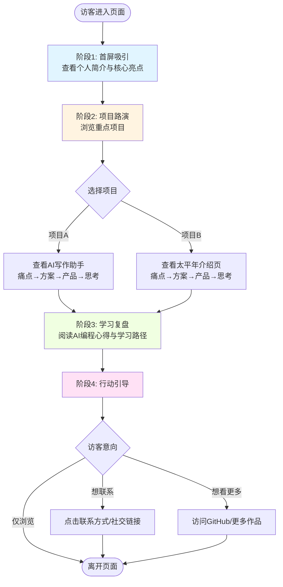

# 产品需求文档：学习成果展示页 - V1.0

## 1. 综述 (Overview)

### 1.1 项目背景与核心问题

**项目目标**：将AI编程课程（7次课）的学习内容融会贯通，制作一个公网可访问的网页，作为课程毕业名片。

**核心问题**：
- AI编程学习者完成课程后缺少一个系统化的成果展示平台
- 已完成的项目（AI写作助手、太平年介绍页）需要统一呈现
- 学习心得与方法论需要结构化整理，以便分享给其他AI编程爱好者

**目标访客**：所有对AI编程感兴趣的人
**核心诉求**：展示产品思维与AI编程学习路径

### 1.2 核心业务流程 / 用户旅程地图

1. **阶段一：首屏吸引** - 让访客快速了解创作者是谁、核心成果是什么
2. **阶段二：项目路演** - 展示产品思维（从痛点到方案到实现的完整过程）
3. **阶段三：学习复盘** - 分享AI编程心得与可复用的学习路径
4. **阶段四：行动引导** - 提供联系方式，引导进一步交流

### 1.3 Mermaid 图（流程/状态/时序）

#### 1.3.1 用户操作流（必填）



---

## 2. 用户故事详述 (User Stories)

### 阶段一：首屏吸引

---

#### **US-01: 首屏快速建立认知**

* **价值陈述 (Value Statement)**:
    * **作为** 访客
    * **我希望** 在首屏快速了解David Li是谁以及核心成果
    * **以便于** 决定是否继续深入浏览

* **业务规则与逻辑 (Business Logic)**:
    1. **前置条件**: 访客通过链接/搜索进入页面
    2. **操作流程 (Happy Path)**:
        - 访客进入页面，立即看到首屏（100vh全屏）
        - 页面展示：姓名、双标签（主标签+副标签）、个人简介、核心成果、引导按钮
        - 背景呈现科技感动效（渐变/网格/粒子动画）
        - 访客点击"向下滚动查看作品"按钮，页面平滑滚动到项目路演区
    3. **异常处理 (Error Handling)**:
        - 背景动效加载失败：降级为静态渐变背景
        - 低性能设备：保持动效运行，不做降级（按用户要求）

* **验收标准 (Acceptance Criteria)**:
    * **场景1: 桌面端首屏展示**
        * **GIVEN** 访客使用桌面浏览器（≥768px）访问页面
        * **WHEN** 页面加载完成
        * **THEN**
            - 首屏高度占满视口（100vh）
            - 所有文字元素居中对齐，按线框图层次展示
            - 背景科技感动效正常运行
            - 页面无loading动画，直接展示内容

    * **场景2: 移动端首屏展示**
        * **GIVEN** 访客使用移动设备（<768px）访问页面
        * **WHEN** 页面加载完成
        * **THEN**
            - 布局自适应，字号缩小
            - 个人简介和核心成果文字可换行
            - 保持居中对齐和层次结构

    * **场景3: 引导按钮交互**
        * **GIVEN** 访客在首屏
        * **WHEN** 点击"向下滚动查看作品"按钮
        * **THEN** 页面平滑滚动到阶段2（项目路演区）

* **页面布局线框图 (ASCII Wireframe)**:

    **桌面端布局**：
    ```text
    ╔════════════════════════════════════════════════════════════════════════╗
    ║                    [背景：科技感渐变/网格/粒子动画]                      ║
    ║                                                                        ║
    ║                                                                        ║
    ║                           David Li                                     ║
    ║                                                                        ║
    ║                     AI时代的产品探索者                                  ║
    ║                       AI技术实践派                                      ║
    ║                                                                        ║
    ║                                                                        ║
    ║              从传统开发到AI编程的实践者，                               ║
    ║              相信AI工具能让每个人成为创造者                              ║
    ║                                                                        ║
    ║                                                                        ║
    ║                  ┌─────────────────────────┐                          ║
    ║                  │  7次课完成2个公网产品    │                          ║
    ║                  └─────────────────────────┘                          ║
    ║                                                                        ║
    ║                                                                        ║
    ║                                                                        ║
    ║                                                                        ║
    ║                     [ 向下滚动查看作品 ↓ ]                             ║
    ║                                                                        ║
    ║                                                                        ║
    ╚════════════════════════════════════════════════════════════════════════╝
    ```

    **移动端布局**：
    ```text
    ╔═══════════════════════════╗
    ║ [背景：科技感动效]         ║
    ║                           ║
    ║      David Li             ║
    ║                           ║
    ║   AI时代的产品探索者       ║
    ║     AI技术实践派          ║
    ║                           ║
    ║   从传统开发到AI编程的     ║
    ║   实践者，相信AI工具能     ║
    ║   让每个人成为创造者       ║
    ║                           ║
    ║  ┌───────────────────┐   ║
    ║  │ 7次课完成2个公网   │   ║
    ║  │     产品          │   ║
    ║  └───────────────────┘   ║
    ║                           ║
    ║                           ║
    ║  [ 向下滚动查看作品 ↓ ]   ║
    ║                           ║
    ╚═══════════════════════════╝
    ```

---

### 阶段二：项目路演

---

#### **US-02: 展示AI写作助手项目**

* **价值陈述 (Value Statement)**:
    * **作为** 访客
    * **我希望** 了解AI写作助手项目从痛点发现到产品实现的完整过程
    * **以便于** 理解创作者的产品思维与技术能力

* **业务规则与逻辑 (Business Logic)**:
    1. **前置条件**: 访客滚动到阶段2（项目路演区）
    2. **操作流程 (Happy Path)**:
        - 访客看到区域标题"产品实践"
        - 看到项目1标题："AI写作助手 (Vibe Writing)"
        - 看到2张产品截图并排展示
        - 看到"访问产品"链接按钮
        - 从上到下阅读：💡痛点发现 → 🎯解决方案 → 🔧遇到的坑 → 📚学到的技术
        - 点击"访问产品"链接，在新标签页打开 https://vibewriting.readark.club/
    3. **异常处理 (Error Handling)**:
        - 截图加载失败：显示占位符 + 文字说明
        - 链接失效：按钮置灰 + 提示"暂时无法访问"

* **业务规则详细说明**:
    * **痛点发现**（2-3句话）：
        > 很多内容创作者（公众号作者、博主）在写作时主要卡在三点：写得慢、灵感断档、成稿"没味道"。更关键的是，市面上一些AI写作工具生成内容"AI味"很重（套话多、句式过于工整、缺少个人感受），影响可读性甚至会被AI检测识别出来。

    * **解决方案**（核心功能）：
        - 多种输入方式：链接抓取、Markdown上传、直接粘贴
        - 多模型支持：OpenAI、Claude、DeepSeek可自由切换
        - 三遍审校机制：内容审校 → 风格优化（降AI味）→ 细节打磨

    * **遇到的坑**（3个坑+解决方式）：
        - **坑1**：输入来源复杂，内容拿不到/拿不干净
          **解决**：统一校验层（文件类型、URL合法性、可访问性判断）+ 异常兜底提示

        - **坑2**：AI润色质量不稳定，"降AI味"容易过度
          **解决**：拆成三遍审校流程（专门做去套话、拆句、替换词、加入态度、短句化）+ UI按步骤展示进度

        - **坑3**：状态管理混乱（可编辑+AI改写+历史版本）
          **解决**：单一数据源 + 版本栈管理（所有改动记录为版本节点，撤销/前进在版本栈上移动）

    * **学到的技术**（3-5条）：
        - Prompt/流程工程：把"写作润色"拆成稳定可控步骤，把"必删清单/替换规则/短句化阈值/标点规范"做成可执行规则集
        - 富文本/Markdown编辑：可编辑标题 + Markdown编辑器 + 字数统计 + 导出/复制的一体化编辑闭环
        - 健壮的输入与错误处理：多输入源统一校验、异常兜底提示、可重试的失败处理

* **验收标准 (Acceptance Criteria)**:
    * **场景1: 项目内容完整展示**
        * **GIVEN** 访客滚动到项目路演区
        * **WHEN** 查看AI写作助手项目
        * **THEN**
            - 项目标题、2张截图、访问链接按钮正确展示
            - 四个模块（痛点、方案、坑、技术）内容完整，排版清晰
            - 截图可点击放大查看（可选）

    * **场景2: 访问产品链接**
        * **GIVEN** 访客在AI写作助手项目区
        * **WHEN** 点击"访问产品"按钮
        * **THEN** 在新标签页打开 https://vibewriting.readark.club/

    * **场景3: 移动端适配**
        * **GIVEN** 访客使用移动设备
        * **WHEN** 查看项目详情
        * **THEN**
            - 2张截图可能竖排展示（根据屏幕宽度）
            - 文字内容自动换行，保持可读性

* **页面布局线框图 (ASCII Wireframe)**:
    ```text
    ╔════════════════════════════════════════════════════════════════════════╗
    ║                          【 产品实践 】                                  ║
    ║                                                                        ║
    ╠════════════════════════════════════════════════════════════════════════╣
    ║                                                                        ║
    ║  ┌──────────────────────────────────────────────────────────────────┐ ║
    ║  │  项目1: AI写作助手 (Vibe Writing)                                 │ ║
    ║  └──────────────────────────────────────────────────────────────────┘ ║
    ║                                                                        ║
    ║  ┌────────────────────┐  ┌────────────────────┐                      ║
    ║  │   [截图1]          │  │   [截图2]          │  [ 访问产品 → ]      ║
    ║  │  {4F91605D...}.png │  │  {9835BED5...}.png │                      ║
    ║  └────────────────────┘  └────────────────────┘                      ║
    ║                                                                        ║
    ║  💡 痛点发现                                                           ║
    ║  ━━━━━━━━━━━━━━━━━━━━━━━━━━━━━━━━━━━━━━━━━━━━━━━━━━━━━━━━━━━       ║
    ║  很多内容创作者在写作时主要卡在三点：写得慢、灵感断档、成稿"没      ║
    ║  味道"。市面上一些AI写作工具生成内容"AI味"很重，影响可读性。       ║
    ║                                                                        ║
    ║  🎯 解决方案                                                           ║
    ║  ━━━━━━━━━━━━━━━━━━━━━━━━━━━━━━━━━━━━━━━━━━━━━━━━━━━━━━━━━━━       ║
    ║  • 多种输入方式：链接抓取、Markdown上传、直接粘贴                    ║
    ║  • 多模型支持：OpenAI、Claude、DeepSeek可自由切换                    ║
    ║  • 三遍审校机制：内容审校 → 风格优化（降AI味）→ 细节打磨            ║
    ║                                                                        ║
    ║  🔧 遇到的坑                                                           ║
    ║  ━━━━━━━━━━━━━━━━━━━━━━━━━━━━━━━━━━━━━━━━━━━━━━━━━━━━━━━━━━━       ║
    ║  [坑1] 输入来源复杂，内容拿不到/拿不干净                              ║
    ║  解决：统一校验层 + 异常兜底提示                                      ║
    ║                                                                        ║
    ║  [坑2] AI润色质量不稳定，"降AI味"容易过度                            ║
    ║  解决：拆成三遍审校流程 + 可控规则集                                  ║
    ║                                                                        ║
    ║  [坑3] 状态管理混乱（编辑+AI改写+历史版本）                          ║
    ║  解决：单一数据源 + 版本栈管理                                        ║
    ║                                                                        ║
    ║  📚 学到的技术                                                         ║
    ║  ━━━━━━━━━━━━━━━━━━━━━━━━━━━━━━━━━━━━━━━━━━━━━━━━━━━━━━━━━━━       ║
    ║  • Prompt/流程工程：把主观任务拆成稳定可控步骤                        ║
    ║  • 富文本/Markdown编辑：一体化编辑闭环                                ║
    ║  • 健壮的输入与错误处理：多源统一校验                                 ║
    ║                                                                        ║
    ╚════════════════════════════════════════════════════════════════════════╝
    ```

---

#### **US-03: 展示太平年介绍页项目**

* **价值陈述 (Value Statement)**:
    * **作为** 访客
    * **我希望** 了解太平年介绍页项目从痛点发现到产品实现的完整过程
    * **以便于** 理解创作者在内容型网站的设计能力与技术选型

* **业务规则与逻辑 (Business Logic)**:
    1. **前置条件**: 访客浏览完AI写作助手项目，继续向下滚动
    2. **操作流程 (Happy Path)**:
        - 访客看到项目2标题："太平年介绍页"
        - 看到2张产品截图并排展示
        - 看到"访问产品"链接按钮
        - 从上到下阅读：💡痛点发现 → 🎯解决方案 → 🔧遇到的坑 → 📚学到的技术
        - 点击"访问产品"链接，在新标签页打开 https://tai-ping-year.netlify.app/
    3. **异常处理 (Error Handling)**:
        - 截图加载失败：显示占位符 + 文字说明
        - 链接失效：按钮置灰 + 提示"暂时无法访问"

* **业务规则详细说明**:
    * **痛点发现**（2-3句话）：
        > 追剧观众、历史爱好者、海外观众和媒体从业者在查《太平年》资料时，信息分散在百科/短视频/新闻/讨论区，缺少"一站式、结构化、可浏览可搜索"的官方介绍页。尤其是这类现象级剧集，需要同时覆盖剧情、角色关系、口碑数据、海外传播、历史科普等内容，单一平台很难完整承载。

    * **解决方案**（核心功能）：
        - 多维度内容：剧情、角色、口碑数据、海外传播、历史科普
        - 交互可视化：全球播出地图、五代十国时间线、角色关系图
        - SEO优化：结构化数据、TVSeries Schema、关键词布局

    * **遇到的坑**（3个坑+解决方式）：
        - **坑1**：信息架构大而全，页面容易"堆内容"导致阅读崩溃
          **解决**：按IA分模块拆解（首屏抓注意力，中段用卡片/表格快速扫读，长内容用折叠/分页/搜索降低阅读成本）

        - **坑2**：SEO与性能目标同时达标困难
          **解决**：技术选型倾向SSR/SSG（Next.js App Router），图片做WebP + 懒加载 + 多分辨率，首屏资源严格控制

        - **坑3**：交互组件（地图/时间线/关系图）数据表达难
          **解决**：把交互组件当"解释工具"设计（地图突出覆盖国家/平台入口，时间线突出关键节点并可交互查看，关系图按阵营分区并标注关系类型）

    * **学到的技术**（3-5条）：
        - Next.js SSR/SSG + SEO工程化：理解内容型站点为什么要优先考虑SSG/SSR、结构化数据、模块级meta管理
        - 性能优化方法论：图片WebP/懒加载/多分辨率、首屏加载<3秒目标的拆解与落地
        - 内容可视化组件选型：地图/时间线适合用D3/ECharts或自定义组件，理解"交互是为信息服务"的设计原则

* **验收标准 (Acceptance Criteria)**:
    * **场景1: 项目内容完整展示**
        * **GIVEN** 访客滚动到太平年项目区
        * **WHEN** 查看项目详情
        * **THEN**
            - 项目标题、2张截图、访问链接按钮正确展示
            - 四个模块（痛点、方案、坑、技术）内容完整，排版清晰
            - 与AI写作助手项目紧凑排列，视觉区分明显

    * **场景2: 访问产品链接**
        * **GIVEN** 访客在太平年项目区
        * **WHEN** 点击"访问产品"按钮
        * **THEN** 在新标签页打开 https://tai-ping-year.netlify.app/

* **页面布局线框图 (ASCII Wireframe)**:
    ```text
    ╔════════════════════════════════════════════════════════════════════════╗
    ║  ┌──────────────────────────────────────────────────────────────────┐ ║
    ║  │  项目2: 太平年介绍页                                              │ ║
    ║  └──────────────────────────────────────────────────────────────────┘ ║
    ║                                                                        ║
    ║  ┌────────────────────┐  ┌────────────────────┐                      ║
    ║  │   [截图3]          │  │   [截图4]          │  [ 访问产品 → ]      ║
    ║  │  {AC5A2C41...}.png │  │  {B83DDB96...}.png │                      ║
    ║  └────────────────────┘  └────────────────────┘                      ║
    ║                                                                        ║
    ║  💡 痛点发现                                                           ║
    ║  ━━━━━━━━━━━━━━━━━━━━━━━━━━━━━━━━━━━━━━━━━━━━━━━━━━━━━━━━━━━       ║
    ║  追剧观众、历史爱好者在查《太平年》资料时，信息分散在百科/短视频      ║
    ║  /新闻，缺少"一站式、结构化、可浏览可搜索"的官方介绍页。             ║
    ║                                                                        ║
    ║  🎯 解决方案                                                           ║
    ║  ━━━━━━━━━━━━━━━━━━━━━━━━━━━━━━━━━━━━━━━━━━━━━━━━━━━━━━━━━━━       ║
    ║  • 多维度内容：剧情、角色、口碑数据、海外传播、历史科普              ║
    ║  • 交互可视化：全球播出地图、五代十国时间线、角色关系图              ║
    ║  • SEO优化：结构化数据、TVSeries Schema、关键词布局                  ║
    ║                                                                        ║
    ║  🔧 遇到的坑                                                           ║
    ║  ━━━━━━━━━━━━━━━━━━━━━━━━━━━━━━━━━━━━━━━━━━━━━━━━━━━━━━━━━━━       ║
    ║  [坑1] 信息架构大而全，页面容易"堆内容"                              ║
    ║  解决：模块化拆解 + 折叠/分页/搜索降低阅读成本                        ║
    ║                                                                        ║
    ║  [坑2] SEO与性能目标同时达标困难                                      ║
    ║  解决：SSR/SSG + WebP懒加载 + 首屏资源严控                            ║
    ║                                                                        ║
    ║  [坑3] 交互组件（地图/时间线）数据表达难                              ║
    ║  解决：把组件当"解释工具"设计，突出关键节点                          ║
    ║                                                                        ║
    ║  📚 学到的技术                                                         ║
    ║  ━━━━━━━━━━━━━━━━━━━━━━━━━━━━━━━━━━━━━━━━━━━━━━━━━━━━━━━━━━━       ║
    ║  • Next.js SSR/SSG + SEO工程化                                         ║
    ║  • 性能优化：WebP/懒加载/多分辨率                                      ║
    ║  • 内容可视化组件：交互为信息服务                                      ║
    ║                                                                        ║
    ╚════════════════════════════════════════════════════════════════════════╝
    ```

---

### 阶段三：学习复盘

---

#### **US-04: 展示学习心得与路径建议**

* **价值陈述 (Value Statement)**:
    * **作为** 访客（AI编程学习者/感兴趣者）
    * **我希望** 了解创作者的AI编程学习心得与可操作的学习路径
    * **以便于** 获得可复用的学习方法，避免走弯路

* **业务规则与逻辑 (Business Logic)**:
    1. **前置条件**: 访客浏览完2个项目展示，继续向下滚动
    2. **操作流程 (Happy Path)**:
        - 访客看到区域标题"学习心得"
        - 看到2个并排的卡片区域：
            - 左侧：💡 AI编程心得（5条核心收获）
            - 右侧：🎯 学习路径建议（5步可操作建议）
        - 访客逐条阅读心得与建议
    3. **异常处理 (Error Handling)**:
        - 内容过长：卡片内可滚动查看
        - 移动端：2个卡片竖排展示

* **业务规则详细说明**:
    * **AI编程心得**（5条核心收获）：
        1. "先把需求写清楚，AI才能写对代码"：PRD/验收标准越具体，AI生成的代码越接近可用；否则会陷入反复返工。
        2. 把不可控任务"拆流程 + 加规则"，比求一次完美prompt更有效：像Vibe Writing的"三遍审校 + 必删清单 + 标点规范"，本质是用流程工程把随机性压住。
        3. AI更像"高级实习生"：能快产出，但你要做架构、边界、验收：输入校验、失败兜底、状态管理、可维护性这些仍需要人来定标准。
        4. 与传统开发最大区别：从"写代码"变成"写约束、写测试点、写对齐标准"：你工作的重心从实现细节转到"定义问题+验证输出"。
        5. 前端项目里，AI的优势在"组件生成与样式迭代"，短板在"复杂状态与边界条件"：越到版本栈、撤销/前进、编辑器联动这种场景，越需要你把状态机/数据流先设计好。

    * **学习路径建议**（5步可操作建议）：
        1. 从"内容型小项目"入门：先做一个单页/多模块站点（类似太平年介绍页），练信息架构、组件拆分、SEO/性能基础。
        2. 第二步做"有闭环的工具型项目"：加入输入→处理→可编辑→导出闭环（类似Vibe Writing的输入、处理、调整、导出四阶段）。
        3. 每个需求都写"验收标准"再让AI生成：先列happy path + error handling，再让AI写代码，最后按验收逐条测。
        4. 学习顺序建议：UI/布局（Tailwind/组件）→ 路由与页面结构（Next.js）→ 数据与状态管理（版本栈/状态机）→ 性能与SEO（图片策略、meta、schema）
        5. 需要避免的坑：
            - 别一上来就堆"高级交互"（地图/时间线/关系图）：先把内容结构跑通，再做可视化增强。
            - 别让AI直接"全量重构"：先让它做小步改动（一个组件/一个函数/一个模块），每一步都可回退。
            - 别忽略异常路径：输入校验、解析失败、API失败、导出/复制失败这些，往往决定产品能不能真正上线。

* **验收标准 (Acceptance Criteria)**:
    * **场景1: 桌面端卡片式展示**
        * **GIVEN** 访客使用桌面浏览器查看学习心得区
        * **WHEN** 滚动到该区域
        * **THEN**
            - 2个卡片并排展示，左侧"AI编程心得"、右侧"学习路径建议"
            - 每个卡片内5条内容清晰列出，带序号
            - 卡片高度一致，内容可读性良好

    * **场景2: 移动端适配**
        * **GIVEN** 访客使用移动设备
        * **WHEN** 查看学习心得区
        * **THEN** 2个卡片竖排展示，保持内容完整性

* **页面布局线框图 (ASCII Wireframe)**:
    ```text
    ╔════════════════════════════════════════════════════════════════════════╗
    ║                          【 学习心得 】                                  ║
    ║                                                                        ║
    ╠════════════════════════════════════════════════════════════════════════╣
    ║                                                                        ║
    ║  ┌──────────────────────────┐  ┌──────────────────────────┐          ║
    ║  │  💡 AI编程心得           │  │  🎯 学习路径建议         │          ║
    ║  │                          │  │                          │          ║
    ║  │  1. 先把需求写清楚，     │  │  1. 从"内容型小项目"     │          ║
    ║  │     AI才能写对代码       │  │     入门                 │          ║
    ║  │                          │  │                          │          ║
    ║  │  2. 拆流程+加规则，      │  │  2. 第二步做"有闭环的   │          ║
    ║  │     比完美prompt更有效   │  │     工具型项目"          │          ║
    ║  │                          │  │                          │          ║
    ║  │  3. AI像高级实习生：     │  │  3. 每个需求都写"验收   │          ║
    ║  │     能快产出，你做架构   │  │     标准"再让AI生成     │          ║
    ║  │                          │  │                          │          ║
    ║  │  4. 从写代码变成写约束、 │  │  4. 学习顺序：UI布局→   │          ║
    ║  │     写测试、写标准       │  │     路由→状态→性能SEO   │          ║
    ║  │                          │  │                          │          ║
    ║  │  5. 前端优势在组件生成， │  │  5. 避免的坑：别堆高级  │          ║
    ║  │     短板在复杂状态       │  │     交互、别全量重构     │          ║
    ║  │                          │  │                          │          ║
    ║  └──────────────────────────┘  └──────────────────────────┘          ║
    ║                                                                        ║
    ╚════════════════════════════════════════════════════════════════════════╝
    ```

---

### 阶段四：行动引导

---

#### **US-05: 提供联系方式引导交流**

* **价值陈述 (Value Statement)**:
    * **作为** 访客
    * **我希望** 找到创作者的联系方式
    * **以便于** 与其交流AI编程相关话题或合作机会

* **业务规则与逻辑 (Business Logic)**:
    1. **前置条件**: 访客浏览完所有内容，滚动到页面底部
    2. **操作流程 (Happy Path)**:
        - 访客看到页脚区域标题："联系我 / Get in Touch"
        - 看到引导文案："如果你对AI编程、产品探索感兴趣，欢迎与我交流"
        - 看到邮箱联系方式：📧 2069904600@qq.com
        - 看到底部版权信息："© 2026 David Li · 学习成果展示页"
        - 点击邮箱地址，打开邮件客户端（mailto链接）
    3. **异常处理 (Error Handling)**:
        - 邮件客户端未配置：复制邮箱地址到剪贴板 + 提示"已复制邮箱地址"

* **验收标准 (Acceptance Criteria)**:
    * **场景1: 页脚完整展示**
        * **GIVEN** 访客滚动到页面底部
        * **WHEN** 查看页脚
        * **THEN**
            - 标题、引导文案、邮箱、版权信息完整展示
            - 整体居中对齐，视觉舒适
            - 与上方内容有明显分隔

    * **场景2: 邮箱链接交互**
        * **GIVEN** 访客在页脚区
        * **WHEN** 点击邮箱地址
        * **THEN** 打开系统默认邮件客户端，收件人自动填充为 2069904600@qq.com

* **页面布局线框图 (ASCII Wireframe)**:
    ```text
    ╔════════════════════════════════════════════════════════════════════════╗
    ║                                                                        ║
    ║                      【 联系我 / Get in Touch 】                        ║
    ║                                                                        ║
    ║                     如果你对AI编程、产品探索感兴趣                       ║
    ║                          欢迎与我交流                                   ║
    ║                                                                        ║
    ║                   ┌─────────────────────────────┐                     ║
    ║                   │  📧  2069904600@qq.com      │                     ║
    ║                   └─────────────────────────────┘                     ║
    ║                                                                        ║
    ║  ────────────────────────────────────────────────────────────────    ║
    ║                                                                        ║
    ║                © 2026 David Li · 学习成果展示页                        ║
    ║                                                                        ║
    ╚════════════════════════════════════════════════════════════════════════╝
    ```

---

## 3. 技术约束与非功能性需求

### 3.1 技术选型建议
- **前端框架**：Next.js（支持SSG/SSR，利于SEO）
- **样式方案**：Tailwind CSS（快速实现科技感设计）
- **动效库**：Three.js / Particles.js（首屏背景动效）
- **图片优化**：WebP格式 + 懒加载
- **部署平台**：Vercel / Netlify（静态站点托管）

### 3.2 性能要求
- 首屏加载时间 < 3秒
- 图片自动优化为WebP格式
- 移动端Lighthouse性能评分 ≥ 90

### 3.3 SEO要求
- 页面标题：David Li - AI时代的产品探索者 | 学习成果展示
- Meta Description：7次AI编程课程实践成果，展示AI写作助手、太平年介绍页等项目，分享产品思维与学习路径
- 结构化数据：Person Schema（个人信息）

### 3.4 响应式适配
- 断点：768px（桌面/移动分界）
- 移动端字号、间距、布局自适应
- 横竖屏切换兼容

### 3.5 浏览器兼容性
- 现代浏览器（Chrome、Firefox、Safari、Edge）最新2个版本
- 移动端浏览器（iOS Safari、Android Chrome）

---

## 4. 资源清单

### 4.1 图片资源
- **产品截图路径**：`D:\claude\Display page\image\`
    - AI写作助手：`{4F91605D-ACD6-4730-B9E5-5380E2D19AD3}.png`, `{9835BED5-9308-417B-A688-BDE198ADA00A}.png`
    - 太平年介绍页：`{AC5A2C41-D90D-407B-8604-60BD7AFECCC8}.png`, `{B83DDB96-8136-46C4-8F94-D5789C5E5C83}.png`

### 4.2 外部链接
- AI写作助手产品链接：https://vibewriting.readark.club/
- 太平年介绍页产品链接：https://tai-ping-year.netlify.app/

### 4.3 联系方式
- 邮箱：2069904600@qq.com

---

## 5. 非目标（明确不做的事）

1. **不做用户登录/注册**：纯展示型页面，无需用户系统
2. **不做评论/留言功能**：访客通过邮件联系即可
3. **不做多语言版本**：V1.0仅支持中文
4. **不做复杂交互**：专注内容展示，避免过度设计
5. **不做数据统计后台**：可接入Google Analytics等第三方统计（可选）

---

## 6. 验收总览

### 6.1 功能验收检查清单
- [ ] 首屏正确展示（桌面端+移动端）
- [ ] 背景科技感动效正常运行
- [ ] "向下滚动"按钮平滑滚动到项目区
- [ ] AI写作助手项目完整展示（截图+内容+链接）
- [ ] 太平年项目完整展示（截图+内容+链接）
- [ ] 学习心得区卡片式展示（桌面并排，移动竖排）
- [ ] 页脚联系方式正确展示
- [ ] 邮箱链接可正常唤起邮件客户端
- [ ] 所有外部链接在新标签页打开

### 6.2 性能验收检查清单
- [ ] 首屏加载时间 < 3秒
- [ ] 图片已优化为WebP格式
- [ ] 移动端Lighthouse性能评分 ≥ 90
- [ ] 响应式适配正常（768px断点）

### 6.3 SEO验收检查清单
- [ ] 页面标题、Meta Description正确设置
- [ ] 结构化数据（Person Schema）已添加
- [ ] 图片ALT属性完整

---

## 7. 附录：PRD版本管理

### 7.1 PRD版本信息
- **版本号**：V1.0
- **创建日期**：2026-02-08
- **PRD文件路径**：`D:\claude\Display page\PRD-学习成果展示页.md`

### 7.2 总集表格行（用于项目PRD台账）
如需将此PRD添加到项目总集（`docs/PRD_REGISTRY.md`），可使用以下表格行：

```markdown
| PRD-001 | 学习成果展示页 | 目标：制作AI编程课程毕业名片（公网可访问）。范围：首屏吸引（个人简介+核心成果）、项目路演（AI写作助手+太平年介绍页，展示痛点→方案→坑→技术）、学习复盘（5条心得+5步路径建议）、页脚联系方式。关键规则：响应式适配（768px断点）、首屏科技感动效、产品截图来自本地image文件夹、两项目紧凑排列。边界：纯展示型（无登录/评论/多语言），SSG/SSR优先（利于SEO），性能目标首屏<3秒。异常：截图加载失败显示占位符，链接失效置灰提示。非目标：不做用户系统、不做复杂交互、不做数据统计后台。 | [PRD-001.md](docs/prd/PRD-001.md) |
```

---

**文档结束**
